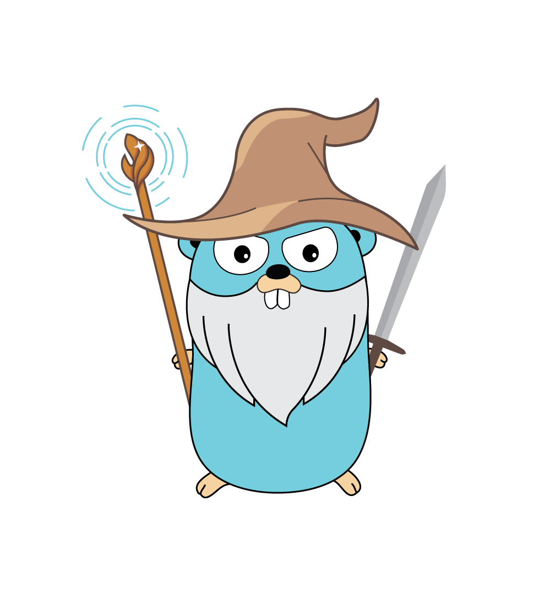

# Gandalf

> One Tool rule them all, One Tool to CI them,
> One Tool to test them all and in the darkness +1 them

At the highest level Gandalf is a tool for contract testing a web API.

# Docs

https://godoc.org/github.com/JumboInteractiveLimited/Gandalf

